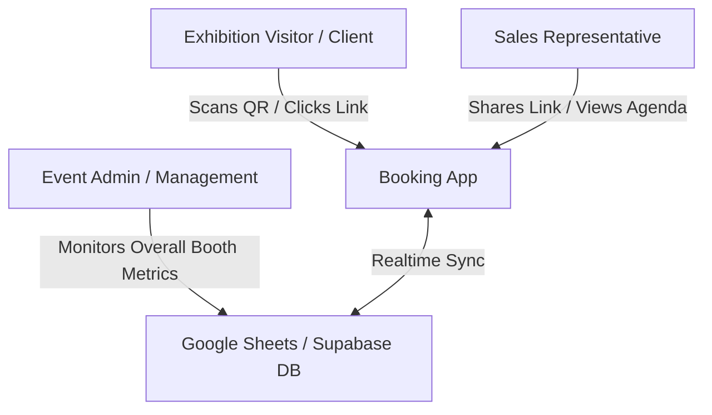
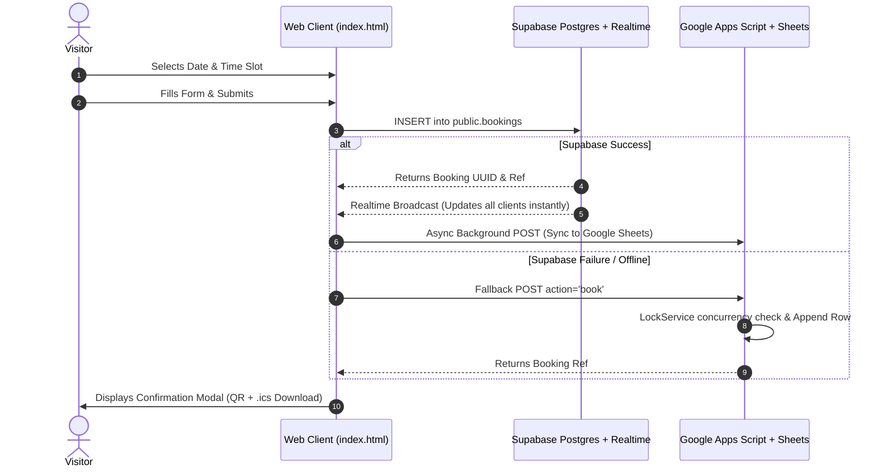

# Product Requirement Document (PRD)
## Universal Oleoresins — Exhibition Meeting Scheduler

| Metadata | Details |
| :--- | :--- |
| **Document Version** | 1.0.0 |
| **Status** | Live / Handed-Off |
| **Target Product** | Exhibition Meeting Scheduler Web Application |
| **Owner / Author** | Senior Product Manager |
| **Last Updated** | August 2026 |
| **Tech Stack** | Vanilla HTML5/JS, Tailwind CSS, Supabase (PostgreSQL + Realtime), Google Apps Script (Google Sheets), QRCode.js, iCalendar (.ics) |

---

## 1. Executive Summary & Vision

### 1.1 Purpose
The **Universal Oleoresins Exhibition Meeting Scheduler** is an enterprise-grade, lightweight web application built to streamline B2B meeting bookings between prospective clients and Universal Oleoresins sales representatives during trade exhibitions (e.g., **Fi India 2026**).

### 1.2 Core Objectives
- **Zero Friction for Visitors**: Allow trade show attendees to book a 15-minute meeting with a dedicated sales representative in under 30 seconds, without requiring account creation or login.
- **Personalized Sales Links**: Enable representatives (e.g., `S003` - Nishesh Shah, `S002` - Jai Shah) to distribute unique booking links (`?s=S003`) via email, WhatsApp, or business card QR codes.
- **Sub-Second Realtime Synchronization**: Prevent double-booking across devices using Supabase Realtime WebSockets combined with database-level unique constraints.
- **Dual-Sync Resilience**: Guarantee 100% operational uptime by maintaining live synchronization between Supabase PostgreSQL and Google Sheets via Google Apps Script (GAS) as a failover backend.
- **Representative Management Portal**: Provide sales representatives with a secure, PIN/email-authenticated agenda viewer to inspect upcoming meetings, export leads to CSV/Excel, and manage cancellations directly at the booth.

---

## 2. User Personas & Key Workflows

### 2.1 Personas



1. **Exhibition Visitor (Client / Buyer)**
   - *Goal*: Quickly schedule a dedicated meeting slot at Stall 3D38 (Hall 3) without waiting in booth queues.
   - *Needs*: Clear time-slot availability, instant confirmation, calendar (.ics) download, SMS/WhatsApp details, and stall location info.

2. **Sales Representative (Universal Oleoresins Team)**
   - *Goal*: Fill exhibition schedule with qualified leads, avoid double bookings, and view daily schedule on mobile.
   - *Needs*: Unique referral link (`?s=S003`), real-time notification/sync, quick access to client details (Company, Phone, Email), and CSV export capability.

3. **Exhibition Admin / Management**
   - *Goal*: Track overall exhibition throughput, monitor rep activity, and ensure all data backs up safely to company Google Drive / ERP.

---

## 3. System Architecture & Tech Stack



### 3.1 Components
- **Client**: Single Page Application (`index.html`) using HTML5, Vanilla JavaScript (ES6+), and Tailwind CSS (CDN).
- **Primary Database & Realtime**: Supabase PostgreSQL with Row Level Security (RLS) and WebSockets enabled (`supabase_realtime`).
- **Backup & Analytics Database**: Google Apps Script (`google_apps_script.js`) bound to Google Sheets ID `1YLKPpuAhTqvvfgwUi29l-U7vws8bHwdT5y41QysqGn0`.
- **Integrations**:
  - QRCode.js for client-side QR generation.
  - Native Data URIs for dynamic `.ics` (iCalendar) creation.
  - WhatsApp Web API for instant booking message sharing.

---

## 4. Database Schema Specification

The database utilizes PostgreSQL hosted on Supabase (`supabase_setup.sql`).

```mermaid
erdiagram
    EXHIBITIONS ||--o{ EXHIBITION_TEAM : has
    SALESMEN ||--o{ EXHIBITION_TEAM : assigned_to
    EXHIBITIONS ||--o{ BOOKINGS : contains
    SALESMEN ||--o{ BOOKINGS : conducts

    SALESMEN {
        varchar_20 id PK
        varchar_100 name
        varchar_150 email
        timestamp created_at
    }

    EXHIBITIONS {
        varchar_50 id PK
        varchar_150 title
        varchar_200 venue
        varchar_100 location
        date start_date
        date end_date
        int slot_length_minutes
        boolean is_active
        timestamp created_at
    }

    EXHIBITION_TEAM {
        varchar_50 exhibition_id PK, FK
        varchar_20 salesman_id PK, FK
    }

    BOOKINGS {
        uuid id PK
        varchar_20 ref UK
        varchar_50 exhibition_id FK
        varchar_20 salesman_id FK
        date date
        varchar_10 time
        varchar_100 first_name
        varchar_100 last_name
        varchar_150 company
        varchar_150 email
        varchar_50 phone
        varchar_20 status
        timestamp created_at
    }
```

### 4.1 Data Tables Overview

#### 1. `public.salesmen`
Stores sales team members.
- `id` (VARCHAR(20), PRIMARY KEY) — e.g. `'S003'`
- `name` (VARCHAR(100), NOT NULL) — Salesperson full name
- `email` (VARCHAR(150), NOT NULL) — Corporate email address
- `created_at` (TIMESTAMPTZ)

#### 2. `public.exhibitions`
Stores event details.
- `id` (VARCHAR(50), PRIMARY KEY) — e.g. `'fi-india-2026'`
- `title` (VARCHAR(150), NOT NULL) — Event title
- `venue` (VARCHAR(200), NOT NULL) — Venue facility
- `location` (VARCHAR(100), NOT NULL) — Stall/Booth position
- `start_date` (DATE, NOT NULL) — Exhibition start date
- `end_date` (DATE, NOT NULL) — Exhibition end date
- `slot_length_minutes` (INT, DEFAULT 15) — Meeting duration
- `is_active` (BOOLEAN, DEFAULT TRUE) — Active state flag
- `created_at` (TIMESTAMPTZ)

#### 3. `public.exhibition_team`
Junction table mapping which salesmen attend which exhibition.
- `exhibition_id` (VARCHAR(50), FK -> `exhibitions.id` ON DELETE CASCADE)
- `salesman_id` (VARCHAR(20), FK -> `salesmen.id` ON DELETE CASCADE)
- `PRIMARY KEY (exhibition_id, salesman_id)`

#### 4. `public.bookings`
Stores visitor meeting registrations.
- `id` (UUID, PRIMARY KEY, DEFAULT `gen_random_uuid()`)
- `ref` (VARCHAR(20), UNIQUE) — Human-readable reference (e.g. `'UO-7X9K2A'`)
- `exhibition_id` (VARCHAR(50), FK -> `exhibitions.id`)
- `salesman_id` (VARCHAR(20), FK -> `salesmen.id`)
- `date` (DATE, NOT NULL) — Meeting date (`YYYY-MM-DD`)
- `time` (VARCHAR(10), NOT NULL) — Slot time (e.g. `'10:15 AM'`)
- `first_name` (VARCHAR(100), NOT NULL)
- `last_name` (VARCHAR(100), NOT NULL)
- `company` (VARCHAR(150), NOT NULL)
- `email` (VARCHAR(150), NOT NULL)
- `phone` (VARCHAR(50), NOT NULL)
- `status` (VARCHAR(20), DEFAULT `'confirmed'`) — `'confirmed'` or `'cancelled'`
- `created_at` (TIMESTAMPTZ)
- `CONSTRAINT unique_salesman_slot UNIQUE (exhibition_id, salesman_id, date, time)`

---

## 5. Functional Requirements Breakdown

### 5.1 Personalized & Lockable URL Routing (P0)
- **URL Syntax**: `index.html?s=S003` or `index.html?salesman=S003`
- **Behavior**:
  - Pre-selects Nishesh Shah (S003) as the designated representative.
  - Displays a green "Personalized Link" badge in the UI banner.
  - Hides the representative dropdown selector to prevent visitor confusion.
  - Defaults gracefully to the first salesman (`S002` Jai Shah) if no URL parameter is provided.

### 5.2 Dynamic Slot Engine & Realtime UI (P0)
- **Slot Generation**: Automatically creates 15-minute time slots between 10:00 AM and 5:00 PM for each active day of the exhibition (e.g., Aug 26, 27, 28).
- **Slot States**:
  - `Available`: White card with subtle border, hover elevation effect.
  - `Booked`: Light gray background with strikethrough text, `cursor: not-allowed`.
  - `My Booking`: Light green background highlighting slots booked in current visitor session.
- **Realtime Listener**: Listens to Supabase channel `public:bookings`. On any `INSERT` or `UPDATE`, updates slot statuses on the UI instantaneously without page refresh.

### 5.3 Booking Flow & Concurrency Protection (P0)
1. User clicks an available time slot.
2. Modal opens displaying Representative Name, Selected Date, and Selected Time.
3. Form collects: First Name, Last Name, Company Name, Email Address, and Phone Number.
4. On Submit:
   - System validates required fields and basic email format.
   - Generates reference ID `UO-XXXXXX`.
   - Attempts insertion into Supabase `bookings`.
   - Database enforces `unique_salesman_slot` constraint. If a race condition occurs, user receives a friendly toast: *"Slot already booked by another user. Please choose another time."*
   - Asynchronously triggers Google Apps Script `action=book` to log into Google Sheets with script `LockService` protection.

### 5.4 Instant Confirmation & Calendar Integration (P0)
- **Modal Display**:
  - Unique Booking Reference (e.g. `UO-K9X3P1`).
  - QR Code encoding booking reference and details.
  - Stall details: BEC Goregaon Mumbai, Stall 3D38, Hall 3.
- **Action Buttons**:
  - **"Add to Calendar (.ics)"**: Generates an iCalendar payload with exact UTC timestamps, summary, location, and description, triggering a native file download.
  - **"Share on WhatsApp"**: Opens WhatsApp with pre-formatted text containing meeting details.

### 5.5 Representative Security & Management Portal (P1)
- **Access**: Representatives click *"View My Meetings"* button in banner.
- **Authentication**: Prompted for verification (Salesman Email / Passcode).
- **Features**:
  - Agenda List: View all confirmed meetings grouped by date.
  - Client Details: View client company, email, phone number, and reference code.
  - Export: 1-click export of rep's meeting list to CSV.
  - Cancel Meeting: Ability to cancel a booking, freeing up the slot in real-time.

---

## 6. Non-Functional Requirements (NFRs)

| NFR Category | Requirement Specification |
| :--- | :--- |
| **Performance** | Page initial load under 1.2s; slot status update under 200ms via WebSockets. |
| **Availability** | 99.99% uptime guaranteed by dual Supabase + Google Sheets infrastructure. |
| **Concurrency** | Handles up to 50 concurrent booking attempts per second without duplicate bookings. |
| **Responsiveness** | Fully fluid layout supporting mobile (320px+), tablet, and desktop viewports. |
| **Security** | Row Level Security (RLS) enabled on all Supabase tables; SQL injection protection via parameterized ORM queries. |

---

## 7. Extended Feature Roadmap (Grounded in Existing Database Schema)

Because the underlying database schema is already highly structured with `exhibitions`, `salesmen`, `exhibition_team`, and `bookings` tables, several powerful features can be unlocked with **zero or minimal schema modifications**.

### 7.1 Immediate Features (ZERO Database Schema Changes Required)

#### 1. Multi-Exhibition Switcher & Archival Portal
- **DB Alignment**: The `exhibitions` table already stores multiple events (`id`, `title`, `is_active`, `start_date`, `end_date`).
- **Feature Specification**: Add an exhibition switcher dropdown in the header. If Universal Oleoresins participates in *Food Ingredients Europe 2026* or *Gulfood 2027*, admins can insert a row into `exhibitions` and link salesmen via `exhibition_team`. Users can switch exhibitions seamlessly or view upcoming schedules.

#### 2. Booth Manager Live Dashboard (Team Overview)
- **DB Alignment**: Query `bookings` grouped by `salesman_id` for a specific `exhibition_id`.
- **Feature Specification**: A real-time grid for the Exhibition Manager showing all 12 representatives side-by-side. Displays occupancy rates (e.g. *"Nishesh Shah: 85% booked"*, *"Jai Shah: 60% booked"*), allowing booth staff to direct walk-in visitors to available representatives.

#### 3. Automatic Salesperson Load Balancer ("Book Any Available Representative")
- **DB Alignment**: Uses existing `exhibition_team` and `bookings` tables.
- **Feature Specification**: If a visitor has no preference for a specific salesperson, a *"Book First Available Sales Specialist"* option checks all assigned team members for the selected date/time slot and assigns the least-busy representative automatically.

#### 4. Auto-Reschedule & Slot Re-assignment Engine
- **DB Alignment**: Updates `date`, `time`, or `salesman_id` in the existing `bookings` record.
- **Feature Specification**: From the Representative Portal or client confirmation page, allow 1-click rescheduling of a meeting to a new time slot or reassigning the meeting to another team member without cancelling and re-entering contact details.

#### 5. Automated Daily Email Digest for Sales Reps
- **DB Alignment**: Triggered via Google Apps Script `handleReport` or Supabase Edge Functions using existing `bookings` data.
- **Feature Specification**: At 8:00 AM every morning of the exhibition, each representative automatically receives an email summarizing their schedule, client names, and company details for that day.

---

### 7.2 Advanced Features (Requiring Minor Schema Extensions)

```mermaid
erdiagram
    BOOKINGS ||--o{ MEETING_NOTES : contains
    BOOKINGS {
        uuid id PK
        varchar_20 lead_tier "HOT/WARM/COLD"
        text product_interest "Oleoresins, Extracts, etc."
        boolean checked_in "Booth Check-in Flag"
    }
    MEETING_NOTES {
        uuid id PK
        uuid booking_id FK
        text note_text
        timestamp created_at
    }
```

#### 1. Post-Meeting Lead Qualification & Notes (`P1`)
- **Schema Addition**: Add `lead_tier` (VARCHAR(10): `'HOT'`, `'WARM'`, `'COLD'`), `product_interests` (TEXT[]), and `notes` (TEXT) to `bookings` (or a sub-table `meeting_notes`).
- **Feature Specification**: During or after a meeting, the sales representative opens their portal, taps on the client card, adds notes (e.g., *"Interested in Paprika Oleoresin 100k CU, requested 5kg sample"*), rates the lead, and saves it directly into the database.

#### 2. Booth Check-In & Walk-In Visitor Badge Scanner (`P1`)
- **Schema Addition**: Add `checked_in` (BOOLEAN DEFAULT FALSE) and `checked_in_at` (TIMESTAMPTZ) to `bookings`.
- **Feature Specification**: When a client arrives at Stall 3D38, booth hostesses scan the client's QR code. The status flips to `Checked In`, sending an instant push notification/WhatsApp alert to the assigned sales representative's phone: *"Client John Doe (Company XYZ) has arrived at reception."*

#### 3. Automated WhatsApp & SMS Reminders (`P2`)
- **Schema Addition**: Add `reminder_sent` (BOOLEAN DEFAULT FALSE) to `bookings`.
- **Feature Specification**: A scheduled cron trigger (via Twilio/Wati integration) sends an automated WhatsApp message 30 minutes before the scheduled meeting: *"Hi John, your meeting with Nishesh Shah at Universal Oleoresins (Stall 3D38) is in 30 minutes. See you soon!"*

#### 4. Custom Representative Slot & Buffer Management (`P2`)
- **Schema Addition**: Add `custom_slot_length` (INT) and `break_times` (JSONB) to `exhibition_team` or `salesmen`.
- **Feature Specification**: Allows individual representatives to customize their daily lunch breaks, buffer times between meetings, or set custom 30-minute slots for VIP executive clients.

---

## 8. Developer Handoff Checklist

- [x] **Database Setup**: Execute `supabase_setup.sql` in Supabase SQL Editor.
- [x] **Realtime Configuration**: Verify table `public.bookings` is added to `supabase_realtime` publication.
- [x] **Row Level Security**: Verify public `SELECT`, `INSERT`, `UPDATE` policies are active.
- [x] **Google Apps Script Backend**: Deploy `google_apps_script.js` as Web App (*Execute as Me*, *Access: Anyone*) and copy URL to `APPS_SCRIPT_URL` in `index.html`.
- [x] **Environment Parameters**: Test personalized links:
  - Rep link: `index.html?s=S003` (Nishesh Shah)
  - Exhibition link: `index.html?e=fi-india-2026`
- [x] **Verification**: Perform double-booking test in two browser tabs simultaneously to verify atomic lock resilience.

---
*End of Product Requirement Document.*
